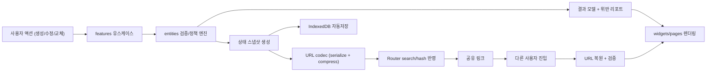

# 학교 시간표 관리 시스템 구현 계획 (FSD 기반, Local-First)

## 참조 문서
- `SPEC.md`
- `survey.md`

## 기술 스택 기준
- 프로젝트 생성은 아래 명령을 기준으로 고정한다.
  `pnpm dlx shadcn@latest create --preset "https://ui.shadcn.com/init?base=base&style=nova&baseColor=neutral&theme=neutral&iconLibrary=hugeicons&font=geist&menuAccent=subtle&menuColor=default&radius=default&template=start&rtl=false" --template start`
- 앱 프레임워크는 **TanStack Start**를 사용한다.
- 스타일링은 **Tailwind CSS**만 사용한다.
- URL 상태 관리는 **TanStack Router(search + hash)** 를 표준으로 사용한다.
- URL 데이터 압축은 **lz-string**(`compressToEncodedURIComponent`)을 사용한다.
- 브라우저 영속 저장은 **IndexedDB(Dexie)** 를 기본으로 사용하고, `localStorage`는 경량 설정값에 한정한다.
- 전역 클라이언트 상태는 **Zustand**를 최소 범위로 사용한다.
- 서버 DB/서버 API는 1차 릴리스에서 사용하지 않는다.

## 1. 목적
- 제약 충족 기반 시간표 생성/수정/교체를 브라우저 단독으로 안정적으로 제공한다.
- 필수 제약 100% 준수, 잠금 보존 부분 재계산, 유효 후보 중심 교체 탐색을 핵심 품질로 고정한다.
- 시간표를 URL로 공유해 교사가 동일한 결과를 조회할 수 있도록 한다.
- 학기 중 정책 변경과 기능 확장을 기존 코드 대규모 수정 없이 수용할 수 있도록 FSD + SOLID 원칙으로 설계한다.

## 2. 아키텍처 개요

### 2.1 레이어 전략 (FSD)
- `app`: 라우팅, URL hydrate/bootstrap, 전역 스토어 프로바이더, 에러 바운더리
- `pages`: 화면 단위 진입점(기초 생성, 편집/재계산, 교체 탐색, 정책 관리)
- `widgets`: 복합 UI(시간표 그리드, 교체 후보 패널, 변경 이력 타임라인, 공유 패널)
- `features`: 사용자 액션 단위 유스케이스(생성, 잠금, 재계산, 교체 확정, URL 공유, 되돌리기/앞으로 가기)
- `entities`: 도메인 모델/검증 규칙/리포지토리 인터페이스(시간표 셀, 제약 정책, 변경 이벤트)
- `shared`: 공통 인프라(URL codec, 로컬 저장소 어댑터, 유틸, 공통 UI, 타입 기초)

### 2.2 슬라이스 전략
- `timetable`: 시간표 구조/셀 상태/스냅샷
- `teacher-policy`: 교사 선호/회피/일일 시수 정책
- `constraint-policy`: 학생/교사 연강 및 일일 제한 정책
- `locking`: 셀 잠금 상태 관리
- `replacement`: 교체 후보 탐색/정렬/확정
- `change-history`: 상태 전이 및 시각화 이벤트
- `share-state`: URL 직렬화/압축/복원 규칙

### 2.3 핵심 아키텍처 결정
- **서버 DB 제거**: 중앙 저장소 없이 브라우저 내부 저장만 사용한다.
- **브라우저 DB 선택**: 웹 호환성과 구현 안정성을 위해 SQLite 대신 IndexedDB를 기본 채택한다.
- **URL 중심 상태 관리**: 공유 가능한 핵심 상태는 URL에 저장하고, 장기 보관/자동저장은 IndexedDB에 저장한다.
- **API 전략 단순화**: 네트워크 API 대신 `repository/usecase` 인터페이스로 내부 경계를 유지한다.

### 2.4 설계 원칙 적용
- SRP: 기능별 유스케이스를 `features` 단위로 분리하고 UI는 표현 책임만 가진다.
- OCP: 제약 검증 규칙과 후보 정렬 규칙을 전략 인터페이스로 열어 신규 정책을 확장으로 추가한다.
- DIP: `features`는 구체 저장 구현(IndexedDB/URL codec)이 아닌 `entities/*/repository` 인터페이스에 의존한다.
- 높은 응집도: 정책/검증/상태 전이는 각 슬라이스에 코로케이션한다.
- 낮은 결합도: 슬라이스 간 직접 참조를 금지하고 `pages/widgets`에서만 합성한다.

## 3. 요구사항 매핑 (SPEC → 구현 항목)

| 요구사항 | 구현 대상(FSD) | 핵심 유스케이스 | 완료 기준 |
|---|---|---|---|
| F1 기초 시간표 자동 생성 | `features/generate-timetable`, `entities/timetable`, `entities/constraint-policy` | 필수 제약 우선 충족 + 선호 점수 최적화 생성 | 필수 제약 위반 0건, 생성 결과/사유 리포트 제공 |
| F2 교사 배치 조건 관리 | `features/manage-teacher-policy`, `entities/teacher-policy` | 회피/선호/연강 허용치 저장 및 유효성 검증 | 상충 조건 저장 차단 + 수정 가이드 제공 |
| F3 수동 수정 및 잠금 | `features/edit-slot`, `features/toggle-lock`, `entities/locking` | 셀 편집/이동, 즉시 충돌 검사, 잠금 상태 반영 | 충돌 시 거부 사유 노출, 상태 태그 동기화 |
| F4 부분 재계산 | `features/recompute-unlocked`, `entities/timetable` | 잠금 고정 후 비잠금 범위 재배치 | 잠금 셀 불변 보장, 실패 시 최선안/원인 제공 |
| F5 학기 중 교체 후보 탐색 | `features/find-replacement-candidates`, `entities/replacement`, `entities/constraint-policy` | 교체 대상 기준 후보 검증/정렬/확정 | 유효 후보만 노출, 후보 없음 시 완화 시뮬레이션 제공 |
| F6 연강/일일 제한 검증 | `features/validate-constraints`, `entities/constraint-policy` | 생성/수정/교체 전후 정책 검증 | 위반 위치/유형/심각도 표준 출력 |
| F7 변경 이력 시각화 | `features/track-change-history`, `entities/change-history`, `widgets/history-timeline` | 이벤트 기록, 상태 전이, 색상+텍스트+아이콘 표시 | BASE/TEMP/CONFIRMED/LOCKED 상태 일관성 보장 |
| F8 되돌리기/앞으로 가기 | `features/undo-redo`, `entities/change-history` | 로컬 커맨드 스택 기반 편집 복원 | 복원 시 검증 재실행 및 UI 동기화 |
| F9 다중 교체 탐색 | `features/find-multi-replacements`, `entities/replacement` | 다중 슬롯 연계 탐색(1:1:N) | 탐색 시간 상한 내 후보 제시(고급 기능 단계) |
| 공유 URL 조회 | `features/share-by-url`, `features/load-from-url`, `entities/share-state` | 상태 직렬화/압축/복원 | 공유 링크로 동일 시간표 조회 가능 |

## 4. 디렉토리 구조 제안

```text
src/
  app/
    providers/
    router/
    bootstrap/
    styles/
  pages/
    timetable-generate-page/
    timetable-edit-page/
    replacement-page/
    policy-admin-page/
  widgets/
    timetable-grid/
    candidate-list-panel/
    constraint-violation-panel/
    history-timeline/
    share-link-panel/
  features/
    generate-timetable/
    manage-teacher-policy/
    edit-slot/
    toggle-lock/
    recompute-unlocked/
    find-replacement-candidates/
    validate-constraints/
    track-change-history/
    undo-redo/
    find-multi-replacements/
    share-by-url/
    load-from-url/
  entities/
    timetable/
      model/
      lib/
    teacher-policy/
      model/
      lib/
    constraint-policy/
      model/
      lib/
    locking/
      model/
      lib/
    replacement/
      model/
      lib/
    change-history/
      model/
      lib/
    share-state/
      model/
      lib/
  shared/
    url/
      schema/
      codec/
    persistence/
      indexeddb/
      local-storage/
      snapshot/
    config/
    lib/
    model/
    ui/
```

## 5. 핵심 컴포넌트/모듈 책임
- `entities/timetable/model`: 시간표 셀, 스냅샷, 상태(BASE/TEMP/CONFIRMED/LOCKED) 타입 정의
- `entities/constraint-policy/lib`: 연강/일일 제한 검증기, 위반 리포트 표준화
- `entities/replacement/lib`: 후보 필터 및 정렬(위반 최소 > 기존안 유사도 > 공강 최소화)
- `entities/share-state/lib`: URL 직렬화 대상 필드 정의(공유 상태 vs 로컬 전용 상태 분리)
- `shared/url/codec`: 상태 JSON ↔ 압축 문자열 변환, 무결성 검사, 복원 실패 처리
- `shared/persistence/indexeddb`: 자동저장 스냅샷/정책/이력 저장과 복원
- `features/load-from-url`: 앱 진입 시 URL 상태 복원 후 도메인 검증 실행
- `features/share-by-url`: 현재 상태를 표준 URL로 생성/복사
- `widgets/timetable-grid`: 그리드 편집 인터랙션, 접근성 라벨, 키보드 이동/확정

## 6. 데이터 흐름



- 공유 가능한 핵심 상태는 URL에 저장한다.
- URL 길이 대응을 위해 대용량 스냅샷은 `location.hash`에 저장하고, 필터/뷰 옵션은 search 파라미터로 관리한다.
- Undo/Redo 스택, 임시 UI 플래그 등은 URL이 아닌 로컬 상태(Zustand + IndexedDB)에 저장한다.
- URL 복원 실패(깨진 링크/수동 수정) 시 최근 로컬 스냅샷으로 폴백하고 오류 안내를 표시한다.

## 7. DB/API 전략 (확정)
- 서버 DB: 사용하지 않는다.
- 브라우저 DB: IndexedDB(Dexie)를 사용한다.
- 로컬 저장 정책:
  - 시간표 스냅샷/정책/변경 이력: IndexedDB
  - 사용자 설정(테마/최근 선택): localStorage
- 네트워크 API: 1차 릴리스에서 사용하지 않는다.
- 권한 모델(MVP): 서버 인증이 없으므로 강제 RBAC는 적용하지 않는다.
- 공유 링크 정책 확정: **옵션 1(조회 전용만 허용)** 으로 고정한다.
- 편집 정책: 링크 수신자는 기본 편집 불가이며, 필요 시 "내 작업으로 복제" 후 로컬 편집만 허용한다.
- 내부 인터페이스:
  - `TimetableRepository`는 `LocalSnapshotRepository` 구현체에 바인딩한다.
  - 향후 중앙 저장소가 필요해지면 `RemoteRepository` 구현을 추가한다.

## 8. 단계별 구현 로드맵

### Phase 1. 기반 구축 (아키텍처/인프라)
- TanStack Start + shadcn 프리셋 기반 초기 프로젝트 생성
- FSD 디렉토리/레이어 가드 설정
- Router/Zustand 기본 프로바이더 구성
- URL 스키마 정의(공유 상태/로컬 상태 경계)
- `lz-string` 기반 URL codec 유틸 구현
- IndexedDB(Dexie) 스토어 설계(스냅샷/정책/이력)
- Tailwind CSS 시멘틱 토큰 맵(색상/텍스트/보더/상태) 정의
- `shared/ui` 공통 UI 컴포넌트 베이스라인 구축

### Phase 2. 핵심 기능(Must) 구현
- F1/F2/F6: 생성 + 교사 정책 + 제한 검증 파이프라인 완성
- F3/F4: 수동 수정/잠금/부분 재계산 완성
- F5: 교체 후보 탐색/정렬/확정 플로우 완성
- 공유 URL 생성/복원 기능 완성
- 회귀 위험 영역(검증/상태 전이/정렬/URL codec) 우선 테스트 작성

### Phase 3. 운영 고도화(Should/Could)
- F7/F8: 변경 이력 시각화 + undo/redo
- F9: 다중 교체 탐색(탐색 비용 제어 포함)
- 오프라인 안정성 향상(충돌 복원 UX, 스냅샷 버전 마이그레이션)

## 9. 테스트/품질 계획
- 단위 테스트: 제약 검증기, 후보 정렬기, 상태 전이 로직
- 단위 테스트: URL codec round-trip(serialize/deserialize), 길이 임계치, 깨진 URL 복구 처리
- 통합 테스트: 생성→수정→재계산→교체 확정→URL 공유 복원 시나리오
- 브라우저 모드 테스트: 시간표 그리드 편집/키보드 조작/접근성 표기
- 품질 게이트: ESLint, TypeScript, FSD 의존 규칙 검증, 핵심 경로 회귀 테스트

## 10. 확장 전략
- 정책 확장: 새 제약(예: 블록타임, 실험실 우선 배치)은 `constraint-policy` 전략 추가로 확장
- 정렬 확장: 교체 후보 랭킹 기준 추가 시 `replacement` 정렬 전략 플러그인만 교체
- 저장소 확장: `Repository` 인터페이스 유지로 향후 원격 API/DB 연동 비용 최소화
- 채널 확장: 향후 모바일/리포트 채널은 `widgets/pages`만 확장하고 도메인 계층은 재사용

## 11. 리스크 및 대응
- URL 길이 초과: 직렬화 필드 최소화 + 압축 + hash 저장 + 임계치 초과 시 로컬 스냅샷 링크로 폴백
- 링크 변조/손상: 스키마 버전과 유효성 검사 실패 시 안전 복구 경로 제공
- 링크 유출: 공유 URL 기본 조회 전용 + 편집 동작 비활성화로 오조작 위험 완화
- 로컬 디바이스 분실/브라우저 데이터 삭제: 수동 내보내기/가져오기(JSON) 기능 제공
- 과도한 잠금으로 재계산 불가: 최소 해제 셀 제안 알고리즘을 기본 제공
- 탐색 비용 급증(F9): 시간 상한 + 빔서치/휴리스틱 탐색으로 계산량 통제
